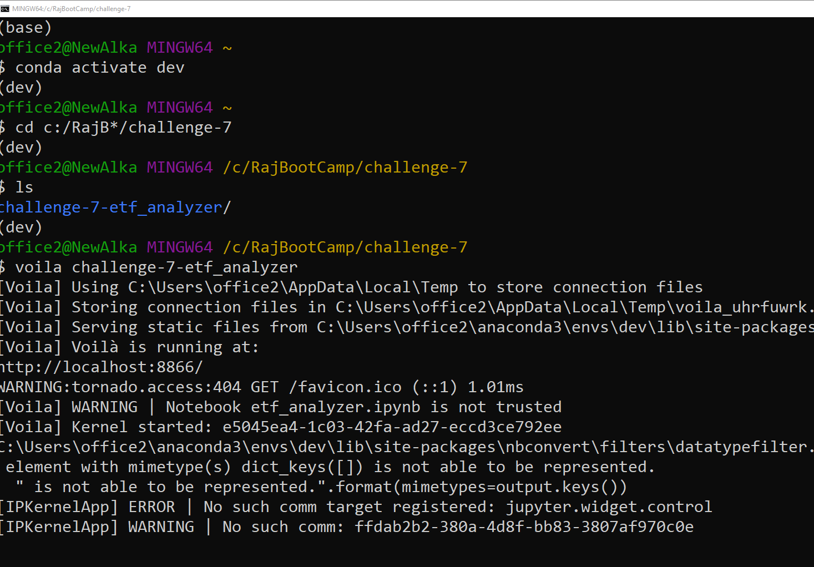
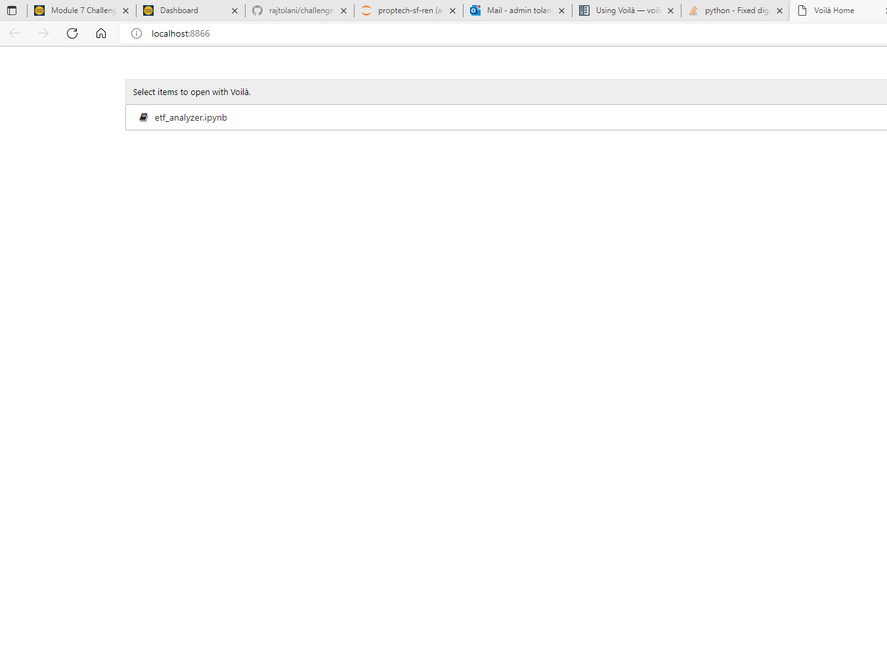
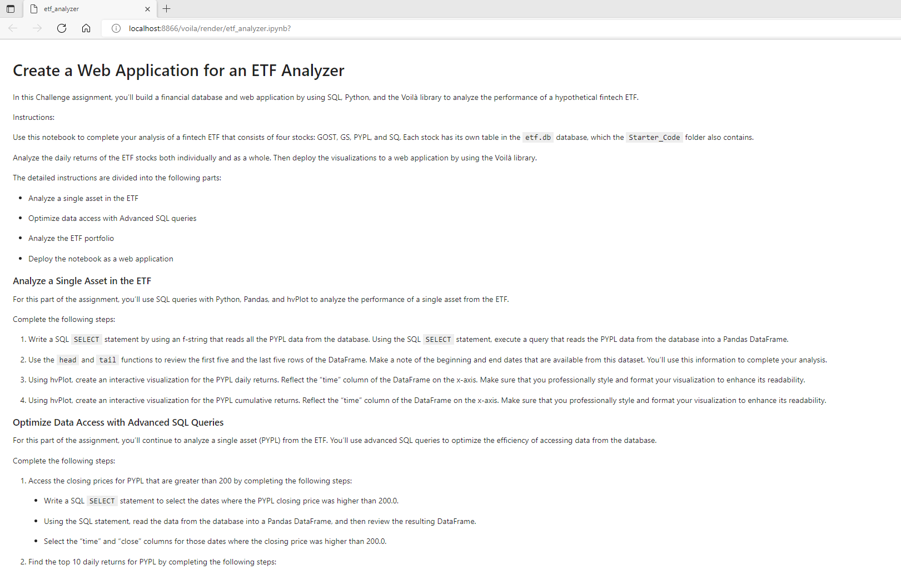
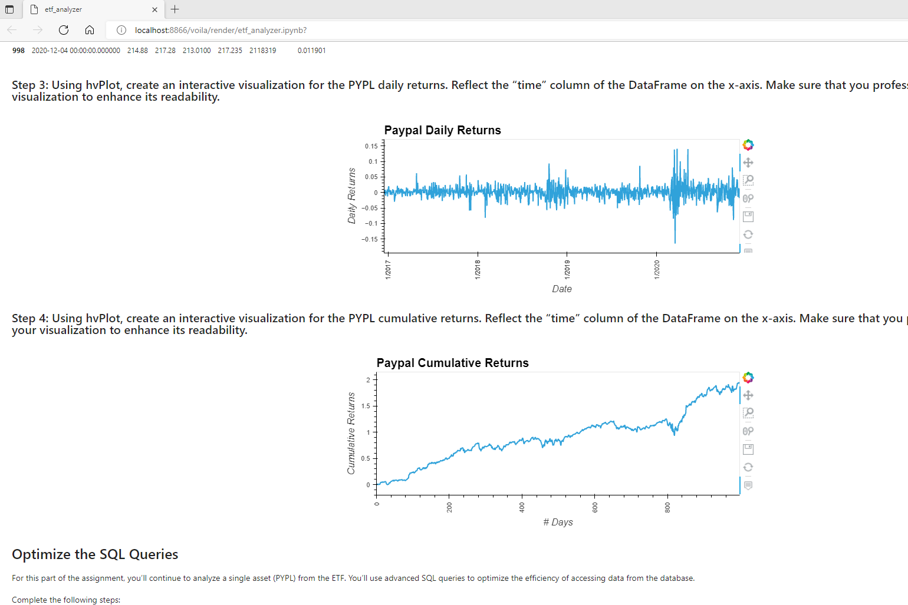
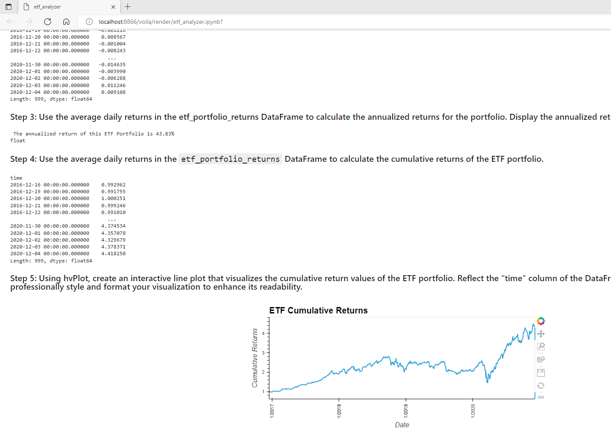
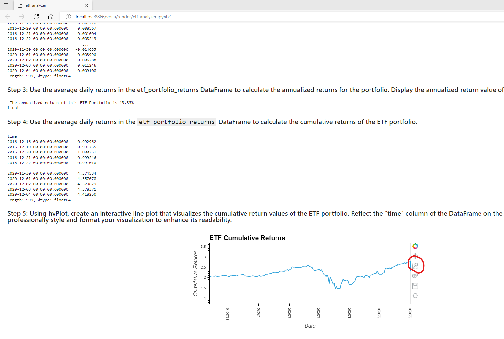

# UCB Virtual FinTech Bootcamp Challenge 7 ETF Analyzer
## Purpose of this Challenge
ETF analyzer uses sqlalchemy to create engine to access the provided sql database 'etf'. It uses variour sql command to find, filter and sort the data. The results are loaded into Pandas object and then pandas is used to further manipulate data and display the results. For results it uses hvplot to show returns from specific stocker ticker as wll as overall ETF performance

## Use of Voila to run this Notebook as a webapp in the browser

Part of this Challenge was to use Voila to deploy this notebook as a webapp. Voila was started in a git bash window. Instead of giving the Jupyter notebook as argument, I chose to start Voila with the folder name in which the Jupyter Notebook is. This has the advantage that I could run the app multiple times in new tabs or new browser windows. 

## Screen Shots showing use of Voila to deploy ETF Analyzer as a Web App
Screen shot showing GIT Bash window where Voila is started. Voila is start with the folder containg the ETF Analyzer app. The start page of Voila should list all apps available in this folder

Screen show of browser showing start page of Voila. Voila started on port 8866, hence the url http://localhost:8866/voila/render/etf_analyzer.ipynb? It shows list of Jupyter Notebooks in this folder. Current there is only on Notebook hend it is the only one displayed. Next we will open the ETF analyzer as web app by clicking on it 

### Following are Screen shots of the output of the ETF app after it executed in new browser window

ETF App Output Screen 1

ETF App Output Screen 2

ETF App Output Screen 3

ETF App showing use of 'Box Zoom' widget in hvplot

